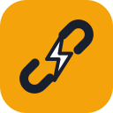
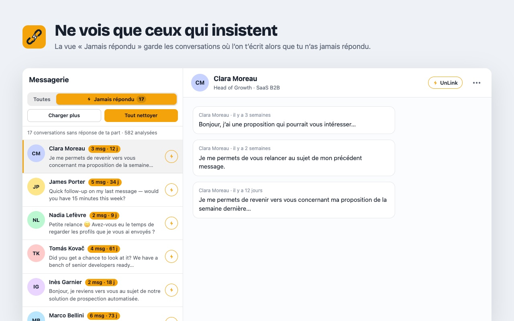

<p align="center"></p>

<h1 align="center">UnLink</h1>

<p align="center">Nettoie ta messagerie LinkedIn des relances sans réponse, en un geste.<br/>Extension Chrome open source — rien ne quitte ton navigateur.</p>

<p align="center"></p>

---

Ta messagerie LinkedIn déborde de messages de prospection qui insistent alors que tu n’as jamais répondu ? UnLink les repère, puis retire la relation et supprime la conversation en un clic ou un raccourci.

## Fonctionnalités

- **Vue ⚡ Jamais répondu** dans la messagerie : seules restent les conversations où la personne t’a écrit sans que tu aies **jamais** répondu (règles réglables : nombre de messages, ancienneté). Rien n’est chargé sans ton clic.
- **Nettoyage en un geste** sur une conversation : bouton ⚡ UnLink ou raccourci `⌥⇧U` / `Alt+Shift+U` → retrait de la relation, puis suppression de la conversation. Délai d’annulation réglable (`Esc`).
- **Nettoyage en masse**, en tâche de fond : liste de toutes les conversations éligibles (photo, titre, lien du profil), traitement par petits lots (7 par défaut) espacés dans le temps. Les personnes décochées sont exclues définitivement.
- **Liste d’exclusion** gérable dans les réglages.
- Fonctionne avec un compte LinkedIn en français ou en anglais (et plusieurs autres langues pour les menus de secours).

## Sécurité : aucun droit à l’erreur

- Une conversation où tu as écrit **ne peut pas** être proposée : l’historique complet est relu auprès de LinkedIn, et relu encore juste avant d’agir. Au moindre doute (historique incomplet, conversation de groupe, compte supprimé « LinkedIn Member »…), rien n’est proposé.
- La personne visée vient de la liste officielle des participants de la conversation et doit correspondre à ce qui est affiché.
- Chaque action est **vérifiée** : la relation doit ne plus exister, la conversation doit être vide. Pas de ✓ sans preuve.
- Les actions passent par les mêmes requêtes que l’interface de LinkedIn ; les clics dans les menus ne servent qu’en secours.

## Confidentialité

Aucun serveur, aucune télémétrie : tout est stocké localement (`chrome.storage`). UnLink ne communique qu’avec linkedin.com, avec ta session. Voir [PRIVACY.md](PRIVACY.md).

## Installation

**Chrome Web Store** : [UnLink sur le Chrome Web Store](https://chromewebstore.google.com/detail/obkdmhneoandnpfcbcfjioepjbpcleag) (en cours d’examen par Google).

**Depuis le code source** :
1. Clone ce dépôt.
2. `chrome://extensions` → active le **Mode développeur** → **Charger l’extension non empaquetée** → choisis le dossier du dépôt.
3. Ouvre ta messagerie LinkedIn et choisis la vue **⚡ Jamais répondu**.

## Développement

```
manifest.json
src/
  background.js          service worker : raccourcis, nettoyage en masse en tâche de fond, badge
  config.js              liens (auteur, dépôt, Buy Me a Coffee)
  shared/                réglages, règles de relance, exclusions, libellés et sélecteurs LinkedIn, outils DOM
  content/               scripts injectés dans LinkedIn (observation réseau, cache, historique, requêtes, messagerie, profil)
  popup/ options/ bulk/ welcome/ ui/   interface de l’extension
assets/                  logos SVG (sources des icônes)
tools/
  test-logic.js          tests unitaires des règles et du parsing  →  node tools/test-logic.js
  e2e/                   test de bout en bout sur un faux LinkedIn local  →  node tools/e2e/run.js (nécessite puppeteer)
  make-icons.js          génère icons/ depuis assets/
  store-assets.js        génère les visuels du Chrome Web Store dans store/
  build.sh               paquet pour le Chrome Web Store  →  dist/unlink-<version>.zip
  release.sh             publie une version : ./tools/release.sh 1.0.1 (tag → GitHub Release → Chrome Web Store)
.github/workflows/       CI (tests à chaque push) et publication sur tag
```

Si LinkedIn change son interface, les libellés et sélecteurs sont centralisés dans `src/shared/labels.js`.

## Auteur

Conçu par [Vassili Joffroy](https://www.linkedin.com/in/vassili-joffroy/), fondateur de [The Forge Agency](https://the-forge.agency/) — plateformes métier et automatisations sur mesure.

Si UnLink te fait gagner du temps : [offre-moi un café ☕](https://buymeacoffee.com/tfa.the.forge.agency).

## Avertissement

UnLink n’est ni affilié à LinkedIn ni approuvé par LinkedIn. Il automatise uniquement des actions que tu déclenches toi-même, sur ton propre compte ; utilise-le avec modération, dans le respect des conditions d’utilisation de LinkedIn.

## Licence

[MIT](LICENSE)
